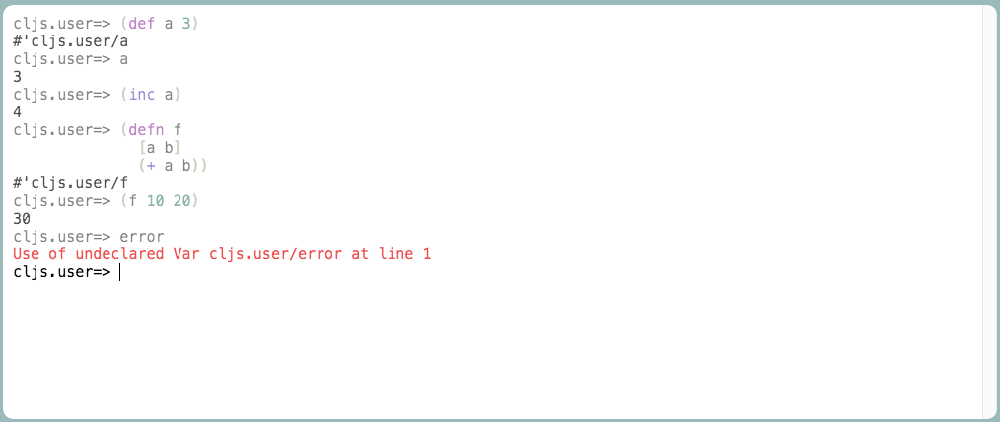

# re-console

## Overview
re-console is an interactive terminal-like REPL. It is implemented using a
[CodeMirror](https://codemirror.net/)
component for user input and
[re-frame](https://github.com/Day8/re-frame) for state management. It
proviedes a user-friendly interface which allows to easily embed it in a web page
and integrate it with an evaluation library (e.g.
[replumb](https://github.com/Lambda-X/replumb)).

## Demo

The sources are located in `src/re_console`,
while the interactive demo is located in `demo/re_console`.
It uses `replumb` as evaluation library.

To start the demo run `boot dev` and browse to
[localhost:3000](http://localhost:3000).



## Usage

Using re-console is as simple as rendering the `console` component, which
accepts two parameters: a unique key and a map of options.

```
(reagent/render [console/console :cnsl-1 (replumb-proxy/eval-opts false ["/js/compiled/out"])]
                  (.getElementById js/document "app"))
```

The unique key is used to identify the console and the map of options
should contain the following keys:

* `:get-prompt`: a zero-arity function, returns a string (the prompt
displayed after each evaluation).
* `:should-eval`: a predicate function that takes the source as input (the
expression to evaluate) and returns true or false depending on whether
it can be evaluated. If `false`, the cursor will be placed on a new line.
* `evaluate`: the main evaluation function, takes as arguments a callback
function (called after evaluation) and the source to evaluate.
Will be called if `should-eval` returns `true`.

The callback function will be called with a map as parameter containing the
following keys:

* `success?`: if `true` the evaluation has succeded
* `result`: the result of the evaluation, can be a valid result or an error
* `prev-ns`: a string indicating the namespace the evaluation took place in
* `source`: the original source

The whole state is kept under the `:consoles` keyword in the global state and
you can nicely interact with it via re-frame
[handlers](https://github.com/ScalaConsultants/re-console/blob/master/src/re_console/handlers.cljs)
(for example for changing the evaluation options or clearing the history).

## Tests

Run `boot test` or `boot auto-test`.

## CSS styling

The re-console component needs a custom CSS file in order to be displayed
correctly. Be sure to add it to your application. A template is found in
[the demo](https://github.com/ScalaConsultants/re-console/blob/master/html/css/re-console.scss).
It's a `scss` file but it's easily convertible to CSS manually or via
[boot](https://github.com/ScalaConsultants/re-console/blob/master/build.boot#L59).

# Community

Many thanks to jaredly's
[reepl](https://github.com/jaredly/reepl) and amasad's
[jq-console](https://github.com/replit/jq-console) for inspiration.

# License

Copyright © 2016

Distributed under the Eclipse Public License.
