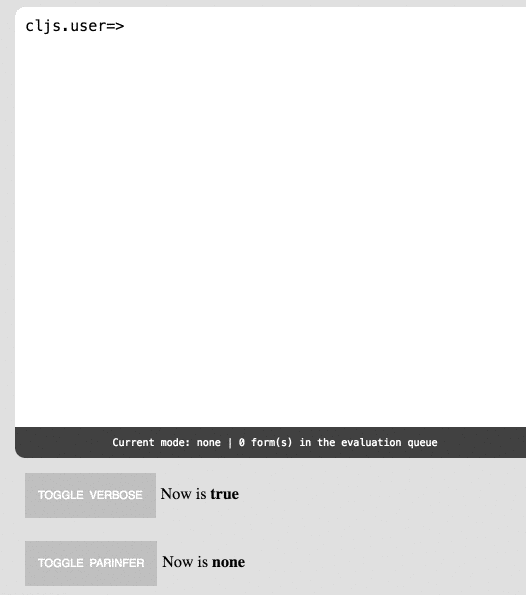

# re-console

[](https://clojars.org/re-console)

## Overview
re-console is an interactive terminal-like REPL. It is implemented using a
[CodeMirror](https://codemirror.net/)
component for user input and
[re-frame](https://github.com/Day8/re-frame) for state management. It
provides a user-friendly interface which allows to easily embed it in a web page
and integrate it with an evaluation library (e.g.
[replumb](https://github.com/Lambda-X/replumb)).

## Demo

The sources are located in `src/re_console`,
while the interactive demo is located in `demo/re_console`.
It uses `replumb` as evaluation library.

To start the demo run `boot dev` and browse to
[localhost:3000](http://localhost:3000).



## Usage

Using re-console is as simple as rendering the `console` component, which
accepts two parameters: a unique key and a map of options.

```
(reagent/render [console/console :key
                                 {:eval-opts (replumb-proxy/eval-opts false ["/js/compiled/out"])
                                  :mode-line? true}]
                  (.getElementById js/document "app"))
```

The unique key is used to identify the console and the map of options
should contain the following keys:

* `:mode`: the input mode, one of `#{:indent-mode, :paren-mode, :none}`
* `:mode-line?`: if `true`, an Emacs-like modeline will be displayed under the
console.
* `:eval-opts`: a map of evaluation options, which in turn contains:

  * `:get-prompt`: a zero-arity function, returns a string (the prompt
  displayed after each evaluation).
  * `:should-eval`: a predicate function that takes the source as input (the
  expression to evaluate) and returns true or false depending on whether
  it can be evaluated. If `false`, the cursor will be placed on a new line.
  * `to-str-fn`: a one-arity function that converts the result to a string.
  If the result is already a string simply use `identity`.
  * `evaluate`: the main evaluation function, takes as arguments a callback
  function (called after evaluation) and the source to evaluate.
  Will be called if `should-eval` returns `true`.

The callback function will be called with a map as parameter containing the
following keys:

* `success?`: if `true` the evaluation has succeded
* `result`: the result of the evaluation (as it is), can be a valid result or an
error
* `prev-ns`: a string indicating the namespace the evaluation took place in
* `source`: the original source

The whole state is kept under the `:consoles` keyword in the global state and
you can nicely interact with it via re-frame
[handlers](https://github.com/Lambda-X/re-console/blob/0.1.2/src/re_console/handlers.cljs)
(for example for changing the evaluation options or clearing the history).

## Tests

Run `boot test` or `boot auto-test`.

## CSS styling

The re-console component needs a custom CSS file in order to be displayed
correctly. Be sure to add it to your application. A template is found in
[the demo](https://github.com/Lambda-X/re-console/blob/0.1.2/html/css/re-console.scss)
It's a `scss` file but it's easily convertible to CSS manually or via
[boot](https://github.com/Lambda-X/re-console/blob/0.1.2/build.boot#L80).

## Parinfer

In order to take advantage of [parinfer](https://shaunlebron.github.io/parinfer/)
you need to do two things:

* include the appropriate JavaScript file in the the compilation set. To do this
add the [:foreign-libs](https://github.com/Lambda-X/re-console/blob/0.1.2/build.boot#L69)
value.

* Switch to parinfer by invokating the `:set-console-mode` handler, passing as
value `:indent-mode`. To disable parinfer, call the same handler with value `:none`.

# Community

Many thanks to jaredly's
[reepl](https://github.com/jaredly/reepl), amasad's
[jq-console](https://github.com/replit/jq-console) and hiram-madelaine's
[codemirror-parinfer](https://github.com/hiram-madelaine/codemirror-parinfer)
for inspiration.

# License

Copyright © 2016

Distributed under the Eclipse Public License.
